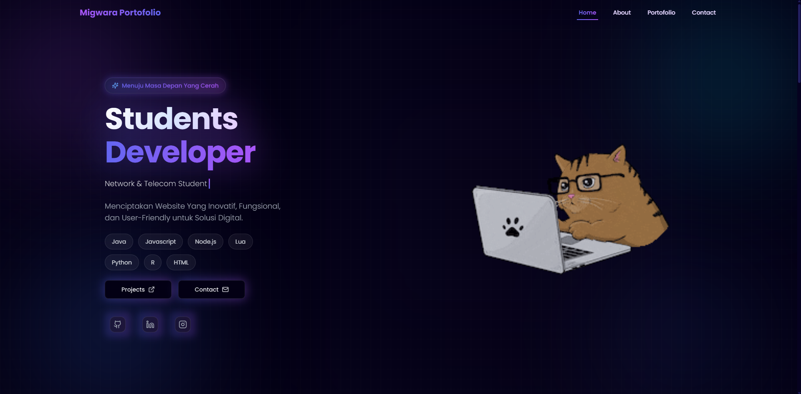

# 🚀 Website Portofolio Profesional




## 📋 Ringkasan

Selamat datang di website portofolio pribadi saya! Proyek ini adalah aplikasi web modern, responsif, dan interaktif yang dirancang untuk menampilkan proyek, keahlian, dan perjalanan profesional saya. Dibangun dengan teknologi web terkini, portofolio ini menampilkan elemen 3D, animasi yang halus, dan pengalaman pengguna yang mulus.

Proyek ini adalah versi kustomisasi dari karya luar biasa oleh [EkiZR](https://github.com/EkiZR/Portofolio_V5).

## ✨ Fitur Utama

*   **🎨 UI/UX Menawan**: Dirancang dengan fokus pada estetika modern, menggunakan **Tailwind CSS** dan **Material UI** untuk tampilan yang elegan.
*   **📱 Responsif Sepenuhnya**: Dioptimalkan untuk semua perangkat, mulai dari desktop hingga ponsel.
*   **🏎️ Performa Tinggi**: Ditenagai oleh **Vite** untuk pengembangan, build, dan kecepatan HMR yang sangat cepat.
*   **🎭 Animasi Halus**: Pengalaman imersif dengan animasi scroll menggunakan **GSAP**, **Framer Motion**, dan **AOS**.
*   **🧊 Interaktivitas 3D**: Terintegrasi dengan scene 3D dari **Spline** untuk dampak visual yang unik.
*   **📝 Efek Tipografi**: Presentasi teks yang dinamis menggunakan **Typewriter Effect**.
*   **🔐 Dashboard Admin**: Area admin yang aman untuk mengelola konten (dibangun dengan autentikasi Firebase).
*   **💬 Interaksi Real-time**: Fitur terintegrasi seperti komentar atau umpan balik menggunakan **Firebase**.
*   **👋 Layar Sambutan**: Animasi intro yang menarik untuk menyambut pengunjung.

## 🛠️ Teknologi yang Digunakan

Proyek ini memanfaatkan serangkaian teknologi modern yang tangguh:

### Inti (Core)
*    **React 18**
*    **Vite**

### Styling & UI
*    **Tailwind CSS**
*    **Material UI**
*   **Styled Components** & **Emotion**
*   **Headless UI** & **Shadcn UI**

### Animasi & 3D
*    **Framer Motion**
*    **GSAP**
*   **Spline** (Scene 3D)
*   **Lottie Files**

### Backend & Layanan
*    **Firebase**

### Ikon
*   **Lucide React**
*   **Heroicons**

## 🚀 Cara Memulai

Ikuti langkah-langkah ini untuk menjalankan proyek secara lokal di mesin Anda.

### Prasyarat

*   Node.js (v18 atau lebih tinggi disarankan)
*   npm atau yarn

### Instalasi

1.  **Clone repositori**
    ```bash
    git clone https://github.com/usernameanda/repo-portofolio-anda.git
    cd repo-portofolio-anda
    ```

2.  **Instal dependensi**
    ```bash
    npm install
    ```

3.  **Jalankan server pengembangan**
    ```bash
    npm run dev
    ```

4.  **Build untuk produksi**
    ```bash
    npm run build
    ```

## 🤝 Kredit

Proyek ini sangat terinspirasi oleh dan dibangun di atas fondasi yang disediakan oleh **[EkiZR/Portofolio_V5](https://github.com/EkiZR/Portofolio_V5)**. Terima kasih banyak kepada Ekizr telah memperbolehkan menggunakaan code!

---

<p align="center">
  Dibuat dengan ❤️ menggunakan React & Tailwind CSS
</p>
